# Модель користувача, навчального контенту та підсистеми аналізу взаємодії

## Загальна архітектура моделей даних

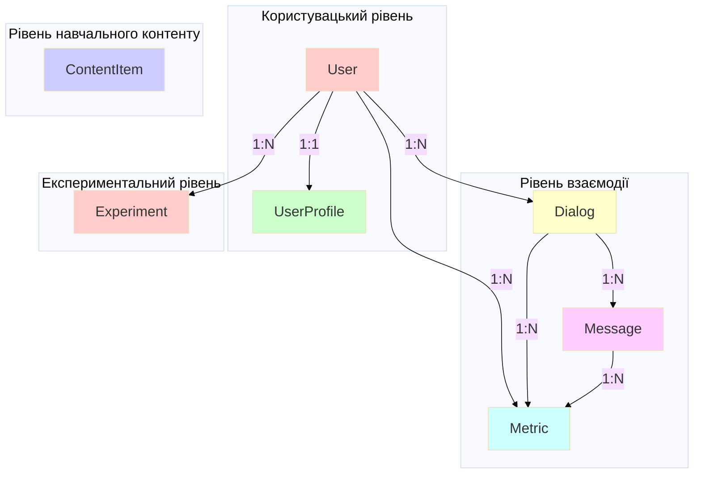

## 2.3.1. Модель користувача і профілю

### Структура користувача (User)

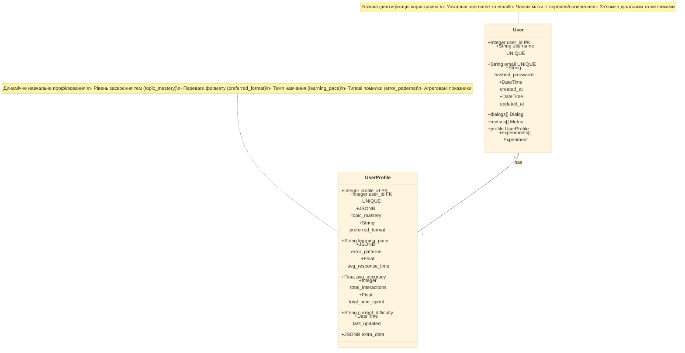

### Структура навчального профілю

```mermaid
%%{init: {'theme':'base', 'themeVariables': {'fontSize':'20px'}}}%%
graph TB
    A[UserProfile] --> B[Статичні параметри]
    A --> C[Динамічні показники]
    A --> D[Агреговані метрики]
    A --> E[Контекстна інформація]

    B --> B1[user_id - зв'язок з користувачем]
    B --> B2[profile_id - унікальний ID]

    C --> C1["topic_mastery (JSONB)<br/>{topic1: 0.75, topic2: 0.60}"]
    C --> C2["preferred_format (String)<br/>text | visual | video | interactive"]
    C --> C3["learning_pace (String)<br/>slow | medium | fast"]
    C --> C4["error_patterns (JSONB)<br/>[pattern1, pattern2, ...]"]
    C --> C5["current_difficulty (String)<br/>easy | normal | hard | challenge"]

    D --> D1[avg_response_time - середній час відповіді]
    D --> D2[avg_accuracy - середня точність]
    D --> D3[total_interactions - кількість взаємодій]
    D --> D4[total_time_spent - загальний час навчання]

    E --> E1[last_updated - час останнього оновлення]
    E --> E2[extra_data (JSONB) - додаткові дані]

    style C fill:#ccffcc
    style D fill:#ffcccc
    style E fill:#ccccff
```

### Процес оновлення профілю користувача

```mermaid
%%{init: {'theme':'base', 'themeVariables': {'fontSize':'20px'}}}%%
flowchart TD
    A[Користувач завершує діалог] --> B[Система збирає метрики]

    B --> C[Обчислення нових значень]

    C --> D{Тип метрики}

    D -->|accuracy| E[Оновити topic_mastery]
    D -->|response_time| F[Оновити avg_response_time]
    D -->|format preference| G[Оновити preferred_format]
    D -->|error data| H[Оновити error_patterns]
    D -->|difficulty feedback| I[Оновити current_difficulty]

    E --> J[EMA Formula:<br/>new_mastery = α × current + rest × old]

    F --> K[Moving Average:<br/>new_avg = rest × old + α × current]

    G --> L{Satisfaction > threshold<br/>AND usage_count > 5?}
    L -->|Так| M[Змінити preferred_format]
    L -->|Ні| N[Залишити поточний]

    H --> O[Аналіз патернів помилок]
    O --> P{Рекурентна помилка?}
    P -->|Так| Q[Додати до error_patterns]
    P -->|Ні| R[Продовжити моніторинг]

    I --> S[Адаптація складності]
    S --> T{Performance}
    T -->|High| U[Підвищити difficulty]
    T -->|Low| V[Знизити difficulty]
    T -->|Optimal| W[Залишити поточний]

    J --> X[Оновити UserProfile]
    K --> X
    M --> X
    N --> X
    Q --> X
    R --> X
    U --> X
    V --> X
    W --> X

    X --> Y[Зберегти в БД]
    Y --> Z[last_updated = now()]

    style J fill:#ccffcc
    style O fill:#ffcccc
    style S fill:#ccccff
    style X fill:#ffffcc
```

### Індекси та оптимізація

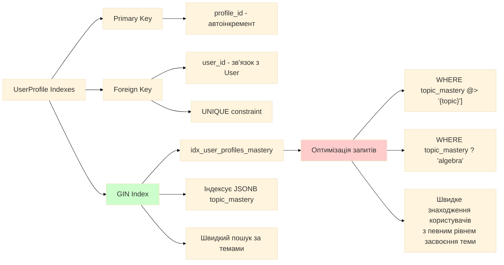

## 2.3.2. Модель навчального контенту

### Структура ContentItem

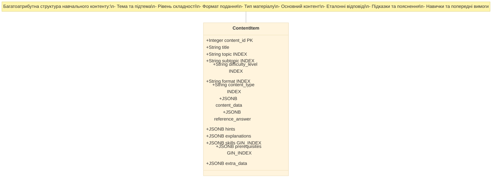

### Атрибути навчального контенту

```mermaid
%%{init: {'theme':'base', 'themeVariables': {'fontSize':'20px'}}}%%
graph TB
    A[ContentItem] --> B[Ідентифікаційні атрибути]
    A --> C[Класифікаційні атрибути]
    A --> D[Навчальний контент]
    A --> E[Допоміжні матеріали]
    A --> F[Структурні зв'язки]

    B --> B1[content_id - унікальний ID]
    B --> B2[title - назва матеріалу]

    C --> C1["topic (String, INDEX)<br/>Основна тема: algebra, geometry, etc."]
    C --> C2["subtopic (String, INDEX)<br/>Підтема: quadratic_equations, etc."]
    C --> C3["difficulty_level (String, INDEX)<br/>easy | normal | hard | challenge"]
    C --> C4["format (String, INDEX)<br/>text | visual | video | interactive"]
    C --> C5["content_type (String, INDEX)<br/>lesson | exercise | quiz | explanation"]

    D --> D1["content_data (JSONB)<br/>Основний навчальний матеріал:<br/>- текст<br/>- зображення<br/>- інтерактивні елементи<br/>- питання"]
    D --> D2["reference_answer (JSONB)<br/>Еталонна відповідь для вправ:<br/>- правильна відповідь<br/>- критерії оцінювання<br/>- допустимі варіанти"]

    E --> E1["hints (JSONB)<br/>Список підказок:<br/>- рівень 1: базова підказка<br/>- рівень 2: деталізована<br/>- рівень 3: покрокове рішення"]
    E --> E2["explanations (JSONB)<br/>Покрокові пояснення:<br/>- крок 1, 2, 3...<br/>- обґрунтування<br/>- приклади"]

    F --> F1["skills (JSONB, GIN_INDEX)<br/>Навички, які розвиває:<br/>[problem_solving, algebra, ...]"]
    F --> F2["prerequisites (JSONB, GIN_INDEX)<br/>Необхідні попередні знання:<br/>[basic_arithmetic, ...]"]
    F --> F3["extra_data (JSONB)<br/>Додаткові метадані:<br/>- автор<br/>- версія<br/>- дата створення"]

    style C fill:#ccffcc
    style D fill:#ffcccc
    style E fill:#ccccff
    style F fill:#ffffcc
```

### Типи навчального контенту

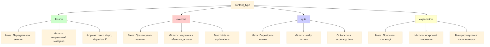

### Рівні складності контенту

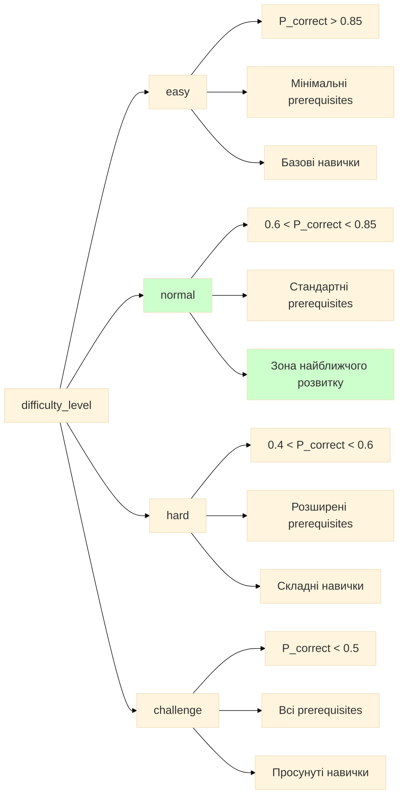

### Формати подання контенту

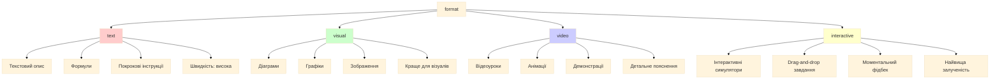

### Індекси контенту та оптимізація запитів

```mermaid
%%{init: {'theme':'base', 'themeVariables': {'fontSize':'20px'}}}%%
graph TB
    A[ContentItem Indexes] --> B[Standard Indexes]
    A --> C[GIN Indexes]

    B --> B1[content_id - Primary Key]
    B --> B2[topic - Пошук за темою]
    B --> B3[subtopic - Пошук за підтемою]
    B --> B4[difficulty_level - Фільтр складності]
    B --> B5[format - Фільтр формату]
    B --> B6[content_type - Фільтр типу]

    C --> C1[idx_content_skills]
    C --> C2[idx_content_prerequisites]

    C1 --> D[Швидкий пошук за навичками]
    D --> D1["WHERE skills @> '[problem_solving]'"]
    D --> D2["WHERE skills ? 'algebra'"]
    D --> D3[Знаходження контенту<br/>що розвиває певну навичку]

    C2 --> E[Швидкий пошук за вимогами]
    E --> E1["WHERE prerequisites <@ user_skills"]
    E --> E2["WHERE NOT prerequisites ?| '{adv_calc}'"]
    E --> E3[Знаходження контенту<br/>доступного для користувача]

    B --> F[Оптимізовані запити]
    F --> F1[SELECT * FROM content_items<br/>WHERE topic = 'algebra'<br/>AND difficulty_level = 'normal'<br/>AND format = 'visual']

    C --> G[Комплексні запити]
    G --> G1[SELECT * FROM content_items<br/>WHERE skills @> user_weak_skills<br/>AND NOT prerequisites ?| user_unknown<br/>AND difficulty_level = adaptive_level]

    style C fill:#ccffcc
    style F fill:#ffcccc
    style G fill:#ffffcc
```

### Процес добору контенту

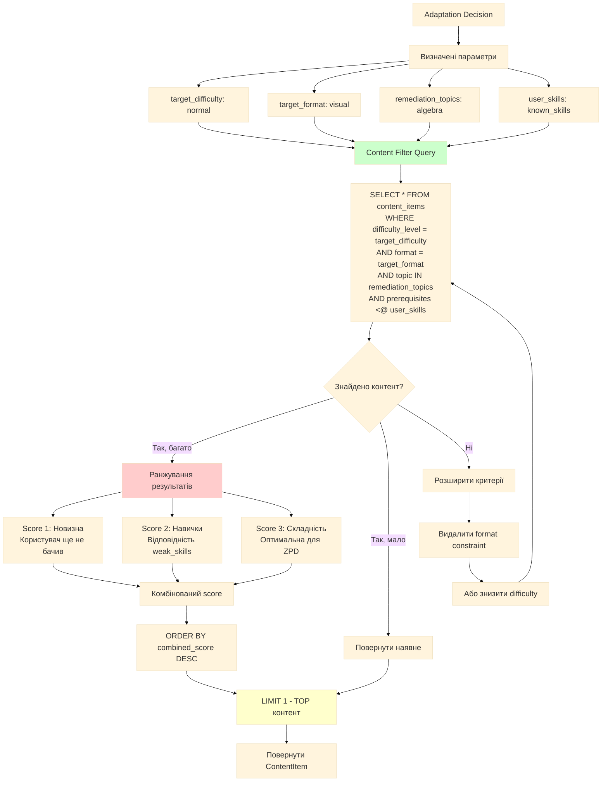

## 2.3.3. Підсистема збору та аналізу дій користувача

### Загальна архітектура збору даних

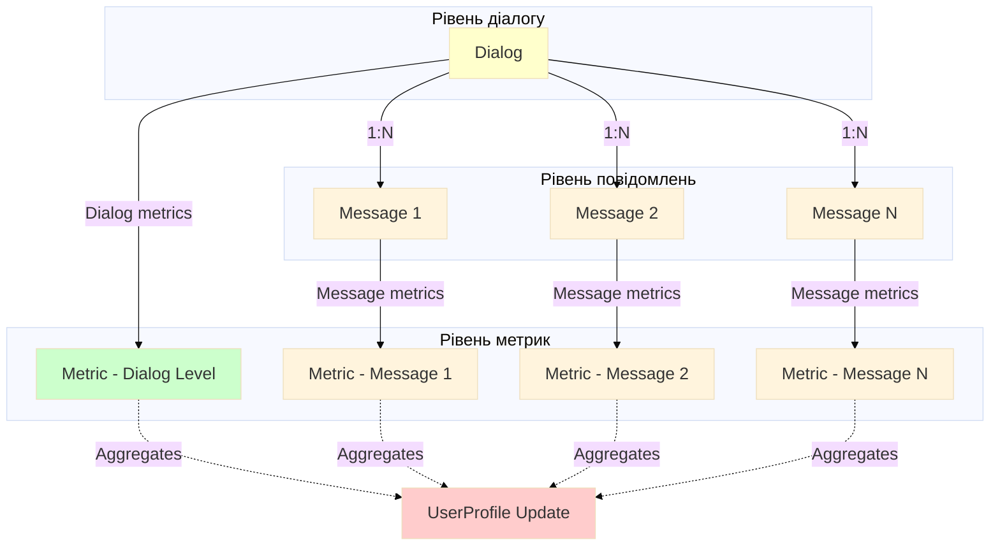

### Модель Dialog - Навчальна сесія

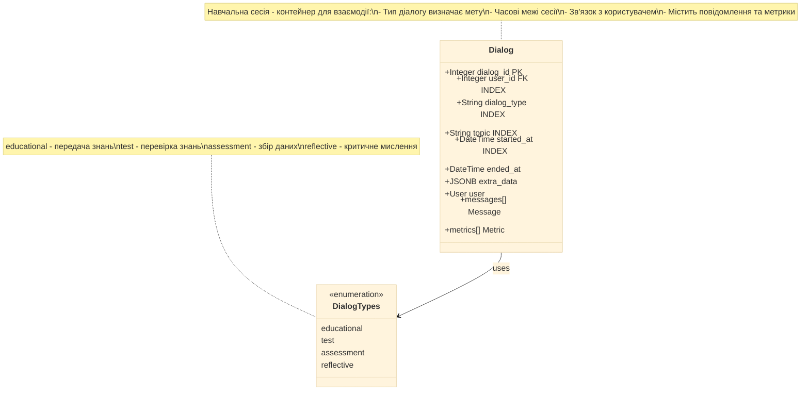

### Типи діалогів та їх характеристики

```mermaid
%%{init: {'theme':'base', 'themeVariables': {'fontSize':'20px'}}}%%
graph TB
    A[dialog_type] --> B[educational]
    A --> C[test]
    A --> D[assessment]
    A --> E[reflective]

    B --> B1[Мета: Передати знання]
    B --> B2["Метрики:<br/>- interaction_time<br/>- followups_count<br/>- satisfaction_score"]
    B --> B3[Формат: Пояснення + питання]
    B --> B4[Адаптація: format, tempo]

    C --> C1[Мета: Перевірити знання]
    C --> C2["Метрики:<br/>- accuracy<br/>- response_time<br/>- attempts_count<br/>- difficulty_result"]
    C --> C3[Формат: Питання + відповіді]
    C --> C4[Адаптація: difficulty, next_topic]

    D --> D1[Мета: Зібрати дані про ефективність]
    D --> D2["Метрики:<br/>- preferred_format<br/>- error_type<br/>- learning_pace<br/>- difficulty_feedback<br/>- satisfaction"]
    D --> D3[Формат: Питання про досвід]
    D --> D4[Адаптація: всі параметри]

    E --> E1[Мета: Розвинути критичне мислення]
    E --> E2["Метрики:<br/>- awareness_score<br/>- explanation_depth<br/>- confidence_level<br/>- error_pattern"]
    E --> E3[Формат: Глибокі питання]
    E --> E4[Адаптація: складність reasoning]

    style B fill:#ccffcc
    style C fill:#ffcccc
    style D fill:#ccccff
    style E fill:#ffffcc
```

### Модель Message - Повідомлення

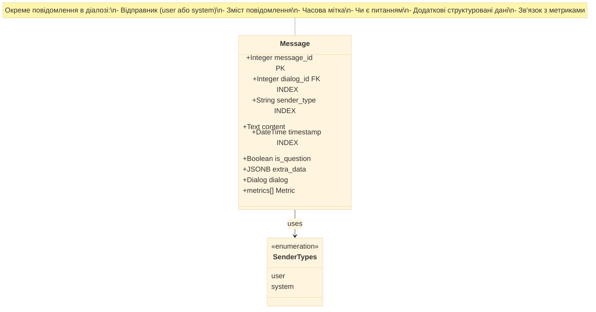

### Потік повідомлень у діалозі

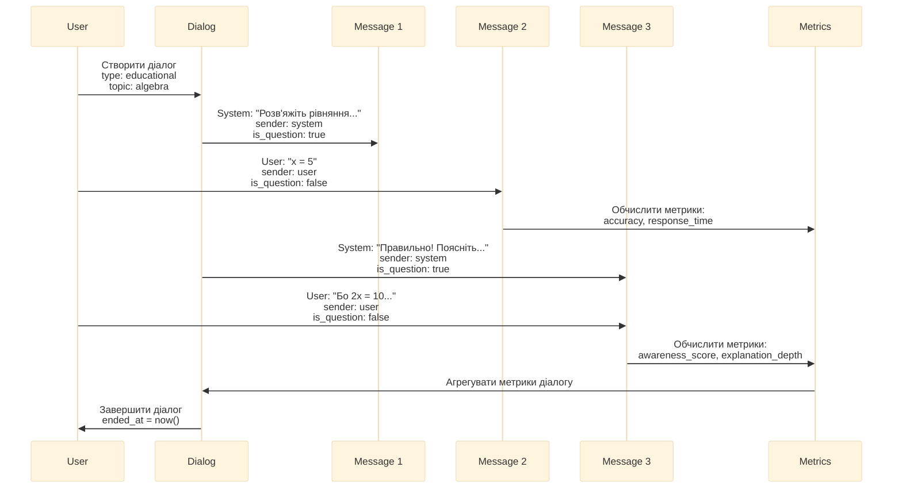

### Модель Metric - Центральна частина аналізу

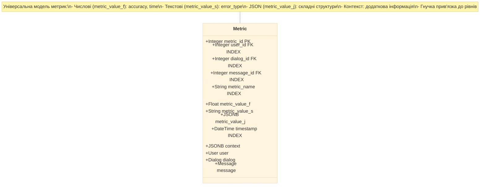

### Типи метрик та їх зберігання

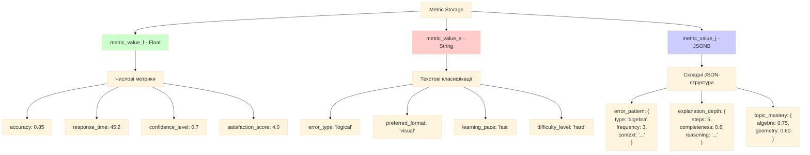

### 17 метрик системи - класифікація

```mermaid
%%{init: {'theme':'base', 'themeVariables': {'fontSize':'20px'}}}%%
graph TB
    A[17 Метрик] --> B[Educational - 3]
    A --> C[Test - 4]
    A --> D[Assessment - 5]
    A --> E[Reflective - 4]
    A --> F[General - 1]

    B --> B1["interaction_time (f)<br/>Час взаємодії з матеріалом"]
    B --> B2["followups_count (f)<br/>Кількість уточнюючих питань"]
    B --> B3["satisfaction_score (f)<br/>Оцінка задоволення 1-5"]

    C --> C1["accuracy (f)<br/>Точність відповіді 0-1"]
    C --> C2["attempts_count (f)<br/>Кількість спроб"]
    C --> C3["response_time (f)<br/>Час відповіді (секунди)"]
    C --> C4["difficulty_result (s)<br/>Чи підходить складність"]

    D --> D1["preferred_format (s)<br/>Формат, що підходить"]
    D --> D2["error_type (s)<br/>Тип помилки"]
    D --> D3["satisfaction_score (f)<br/>Задоволення процесом"]
    D --> D4["learning_pace (s)<br/>Швидкість навчання"]
    D --> D5["difficulty_feedback (s)<br/>Відгук про складність"]

    E --> E1["awareness_score (f)<br/>Рівень усвідомлення 0-1"]
    E --> E2["explanation_depth (j)<br/>Глибина пояснення"]
    E --> E3["confidence_level (f)<br/>Впевненість у відповіді"]
    E --> E4["error_pattern (j)<br/>Патерн помилок"]

    F --> F1["difficulty_level (s)<br/>Поточна складність"]

    style B fill:#ccffcc
    style C fill:#ffcccc
    style D fill:#ccccff
    style E fill:#ffffcc
    style F fill:#ffdddd
```

### Процес обчислення та зберігання метрик

```mermaid
%%{init: {'theme':'base', 'themeVariables': {'fontSize':'20px'}}}%%
flowchart TD
    A[Подія користувача] --> B{Тип події}

    B -->|Відповідь на питання| C[Обчислити базові метрики]
    B -->|Відправлення пояснення| D[Обчислити рефлексивні метрики]
    B -->|Запит підказки| E[Обчислити поведінкові метрики]
    B -->|Оцінка досвіду| F[Обчислити оціночні метрики]

    C --> C1["accuracy (f)<br/>correct = 1, incorrect = 0"]
    C --> C2["response_time (f)<br/>timestamp_answer - timestamp_question"]
    C --> C3["attempts_count (f)<br/>Лічильник спроб"]

    D --> D1["explanation_depth (j)<br/>Аналіз тексту пояснення"]
    D --> D2["awareness_score (f)<br/>LLM оцінка усвідомлення"]
    D --> D3["confidence_level (f)<br/>Експліцитна або імпліцитна"]

    E --> E1["followups_count (f)<br/>Інкремент лічильника"]
    E --> E2["interaction_time (f)<br/>Час з моменту початку"]

    F --> F1["satisfaction_score (f)<br/>Рейтинг 1-5"]
    F --> F2["preferred_format (s)<br/>Обраний формат"]
    F --> F3["difficulty_feedback (s)<br/>too_easy | ok | too_hard"]

    C1 --> G[Зберегти в Metric]
    C2 --> G
    C3 --> G
    D1 --> G
    D2 --> G
    D3 --> G
    E1 --> G
    E2 --> G
    F1 --> G
    F2 --> G
    F3 --> G

    G --> H[Metric record]
    H --> I[user_id = current_user]
    H --> J[dialog_id = current_dialog]
    H --> K[message_id = current_message OR null]
    H --> L[metric_name = назва метрики]
    H --> M[metric_value_X = значення]
    H --> N[timestamp = now rest]
    H --> O[context = додаткові дані]

    I --> P[INSERT INTO metrics]
    J --> P
    K --> P
    L --> P
    M --> P
    N --> P
    O --> P

    P --> Q[Збережено в БД]

    style C fill:#ffcccc
    style D fill:#ffffcc
    style E fill:#ccffcc
    style F fill:#ccccff
    style G fill:#ffccff
```

### Індекси Metric та оптимізація

```mermaid
%%{init: {'theme':'base', 'themeVariables': {'fontSize':'20px'}}}%%
graph TB
    A[Metric Indexes] --> B[Primary Key]
    A --> C[Foreign Keys]
    A --> D[Composite Index]
    A --> E[Timestamp Index]

    B --> B1[metric_id - автоінкремент]

    C --> C1[user_id - INDEX]
    C --> C2[dialog_id - INDEX]
    C --> C3[message_id - INDEX]

    D --> D1[idx_metrics_user_name]
    D1 --> D2[Composite: user_id + metric_name]
    D2 --> D3[Швидкий пошук метрик<br/>конкретного користувача]

    E --> E1[timestamp - INDEX]
    E1 --> E2[Часові запити]
    E2 --> E3[Пошук метрик за періодом]

    D3 --> F[Оптимізовані запити]
    F --> F1["SELECT * FROM metrics<br/>WHERE user_id = 123<br/>AND metric_name = 'accuracy'<br/>ORDER BY timestamp DESC<br/>LIMIT 10"]

    F --> F2["SELECT AVG(metric_value_f)<br/>FROM metrics<br/>WHERE user_id = 123<br/>AND metric_name = 'accuracy'<br/>AND timestamp > now() - interval '7 days'"]

    E3 --> G[Часові аналізи]
    G --> G1["SELECT metric_name, AVG(metric_value_f)<br/>FROM metrics<br/>WHERE user_id = 123<br/>AND timestamp BETWEEN start AND end<br/>GROUP BY metric_name"]

    style D fill:#ccffcc
    style F fill:#ffcccc
    style G fill:#ffffcc
```

### Зв'язок метрик з рівнями системи

```mermaid
%%{init: {'theme':'base', 'themeVariables': {'fontSize':'20px'}}}%%
graph TB
    A[Metric] --> B{Рівень прив'язки}

    B -->|Dialog Level| C[Метрики на рівні діалогу]
    B -->|Message Level| D[Метрики на рівні повідомлення]
    B -->|User Level| E[Метрики на рівні користувача]

    C --> C1["message_id = NULL<br/>dialog_id = ID діалогу"]
    C --> C2[Приклади:]
    C2 --> C3[total_interaction_time]
    C2 --> C4[overall_satisfaction]
    C2 --> C5[dialog_completion_rate]

    D --> D1["message_id = ID повідомлення<br/>dialog_id = ID діалогу"]
    D --> D2[Приклади:]
    D2 --> D3[accuracy - за конкретну відповідь]
    D2 --> D4[response_time - за питання]
    D2 --> D5[explanation_depth - за пояснення]

    E --> E1["message_id = NULL<br/>dialog_id = NULL"]
    E --> E2[Приклади:]
    E2 --> E3[global_accuracy]
    E2 --> E4[overall_learning_progress]
    E2 --> E5[cumulative_time_spent]

    C --> F[Використання]
    D --> F
    E --> F

    F --> G[Агрегація в UserProfile]
    G --> H[topic_mastery]
    G --> I[avg_accuracy]
    G --> J[avg_response_time]
    G --> K[total_interactions]

    style C fill:#ffffcc
    style D fill:#ccffcc
    style E fill:#ffcccc
    style G fill:#ccccff
```

## 2.3.4. Підсистема обробки результатів навчання

### Процес обробки результатів після діалогу

```mermaid
%%{init: {'theme':'base', 'themeVariables': {'fontSize':'20px'}}}%%
flowchart TD
    A[Діалог завершено] --> B[Збір всіх метрик діалогу]

    B --> C[SELECT * FROM metrics<br/>WHERE dialog_id = current_dialog]

    C --> D[Групування метрик]

    D --> E[Навчальні метрики]
    D --> F[Тестові метрики]
    D --> G[Оціночні метрики]
    D --> H[Рефлексивні метрики]

    E --> I[Обчислення агрегатів]
    F --> I
    G --> I
    H --> I

    I --> J[avg_accuracy для діалогу]
    I --> K[total_response_time]
    I --> L[hints_used_count]
    I --> M[avg_satisfaction]
    I --> N[detected_error_patterns]

    J --> O[Оновлення UserProfile]
    K --> O
    L --> O
    M --> O
    N --> O

    O --> P[topic_mastery update]
    O --> Q[avg_accuracy update]
    O --> R[avg_response_time update]
    O --> S[error_patterns update]
    O --> T[preferred_format update]
    O --> U[total_interactions + 1]

    P --> V[Підготовка даних для адаптації]
    Q --> V
    R --> V
    S --> V
    T --> V

    V --> W[Feature Vector Creation]
    W --> X[17 normalized metrics]

    X --> Y{Режим адаптації}

    Y -->|Level A| Z1[Rules Adapter]
    Y -->|Level B| Z2[Contextual Bandit]
    Y -->|Level C| Z3[IRT/BKT]

    Z1 --> AA[Рекомендація]
    Z2 --> AA
    Z3 --> AA

    style I fill:#ccffcc
    style O fill:#ffcccc
    style V fill:#ccccff
    style AA fill:#ffffcc
```

### Структура рекомендації

```mermaid
%%{init: {'theme':'base', 'themeVariables': {'fontSize':'20px'}}}%%
classDiagram
    class AdaptationDecision {
        +String next_difficulty
        +String next_format
        +String next_content_type
        +Float confidence_score
        +List~String~ remediation_focus
        +String tempo_adjustment
        +String reasoning
        +Dict extra_params
    }

    class DifficultyLevels {
        <<enumeration>>
        easy
        normal
        hard
        challenge
    }

    class FormatTypes {
        <<enumeration>>
        text
        visual
        video
        interactive
    }

    class ContentTypes {
        <<enumeration>>
        lesson
        exercise
        quiz
        explanation
    }

    class TempoAdjustments {
        <<enumeration>>
        slow_down
        maintain
        speed_up
    }

    AdaptationDecision --> DifficultyLevels : next_difficulty
    AdaptationDecision --> FormatTypes : next_format
    AdaptationDecision --> ContentTypes : next_content_type
    AdaptationDecision --> TempoAdjustments : tempo_adjustment

    note for AdaptationDecision "Комплексна рекомендація:\n- Рівень складності\n- Формат подання\n- Тип контенту\n- Теми для підкріплення\n- Коригування темпу\n- Пояснення рішення\n- Впевненість системи"
```

### Формування reward для бандита

```mermaid
%%{init: {'theme':'base', 'themeVariables': {'fontSize':'20px'}}}%%
flowchart LR
    A[Результати діалогу] --> B[Компоненти reward]

    B --> C["correct_answer<br/>1.0 якщо правильно<br/>0.0 якщо ні"]
    B --> D["hints_used<br/>Кількість використаних підказок<br/>normalized to 0-1"]
    B --> E["satisfaction<br/>Оцінка задоволення 1-5<br/>normalized to 0-1"]
    B --> F["completion<br/>Чи завершив діалог<br/>1.0 або 0.0"]

    C --> G[Weighted Sum]
    D --> G
    E --> G
    F --> G

    G --> H["reward = <br/>0.5 × correct +<br/>0.2 × not hints_used +<br/>0.2 × satisfaction +<br/>0.1 × completion"]

    H --> I[Нормалізація]
    I --> J[reward ∈ range 0, 1]

    J --> K[Використання в LinUCB]
    K --> L["A = A + x × x_T<br/>b = b + reward × x"]

    L --> M[Оновлення моделі бандита]

    M --> N[Покращення наступних рекомендацій]

    style G fill:#ccffcc
    style H fill:#ffffcc
    style L fill:#ffcccc
```

### Повний цикл: від події до рекомендації

```mermaid
%%{init: {'theme':'base', 'themeVariables': {'fontSize':'20px'}}}%%
sequenceDiagram
    participant U as User
    participant D as Dialog
    participant M as Message
    participant Met as Metrics
    participant UP as UserProfile
    participant AE as Adaptation Engine
    participant CS as Content Service

    U->>D: Відповідає на завдання
    D->>M: Створити Message

    M->>Met: Обчислити метрики
    Met->>Met: accuracy = 0.85
    Met->>Met: response_time = 45s
    Met->>Met: attempts = 1

    Met->>Met: Зберегти Metric records

    Note over Met: message_id = M.id<br/>dialog_id = D.id<br/>user_id = U.id

    U->>D: Завершити діалог
    D->>D: ended_at = now()

    D->>Met: Агрегувати метрики діалогу

    Met->>UP: Оновити UserProfile
    UP->>UP: topic_mastery update (EMA)
    UP->>UP: avg_accuracy update
    UP->>UP: avg_response_time update
    UP->>UP: total_interactions + 1

    UP->>AE: Запит рекомендації
    AE->>UP: Отримати поточний profile
    AE->>Met: Отримати recent metrics

    AE->>AE: Створити feature vector
    AE->>AE: Застосувати адаптацію<br/>rest Level A/B/C)

    AE->>AE: Decision:<br/>difficulty: hard<br/>format: visual<br/>remediation: algebra

    AE->>CS: Запит контенту
    CS->>CS: Знайти відповідний ContentItem

    CS-->>AE: ContentItem
    AE-->>D: Рекомендація + контент
    D-->>U: Наступне завдання

    Note over U,D: Цикл повторюється
```

### Агрегація метрик у профіль - EMA

```mermaid
%%{init: {'theme':'base', 'themeVariables': {'fontSize':'20px'}}}%%
flowchart TD
    A[Нова метрика: accuracy = 0.85] --> B[Отримати поточне значення]

    B --> C[current_topic_mastery = 0.70]

    C --> D[Застосувати EMA Formula]

    D --> E["α = 0.3 (learning rate)<br/>new = α × current_value + rest - α) × old_value"]

    E --> F["new_mastery = 0.3 × 0.85 + 0.7 × 0.70"]

    F --> G["new_mastery = 0.255 + 0.490"]

    G --> H["new_mastery = 0.745"]

    H --> I[Оновити UserProfile]
    I --> J["UPDATE user_profiles<br/>SET topic_mastery = jsonb_set()<br/>WHERE user_id = current_user"]

    J --> K[Збережено в БД]

    K --> L{Порівняння з порогом}

    L -->|new_mastery >= 0.8| M[Тема освоєна!]
    L -->|new_mastery < 0.8| N[Продовжити навчання]

    M --> O[Перейти до наступної теми]
    N --> P[Продовжити поточну тему<br/>можливо змінити difficulty]

    style D fill:#ccffcc
    style E fill:#ffffcc
    style I fill:#ffcccc
    style L fill:#ccccff
```

### Виявлення патернів помилок

```mermaid
%%{init: {'theme':'base', 'themeVariables': {'fontSize':'20px'}}}%%
flowchart TD
    A[Помилка користувача] --> B[Аналіз помилки]

    B --> C[Визначити error_type]
    C --> D{Тип помилки}

    D -->|Концептуальна| E["conceptual<br/>Неправильне розуміння концепції"]
    D -->|Логічна| F["logical<br/>Помилка в міркуванні"]
    D -->|Обчислювальна| G["computational<br/>Арифметична помилка"]
    D -->|Синтаксична| H["syntax<br/>Неправильний запис"]

    E --> I[Зберегти в Metric]
    F --> I
    G --> I
    H --> I

    I --> J["metric_name = 'error_type'<br/>metric_value_s = тип помилки<br/>metric_value_j = {<br/>  context: 'деталі',<br/>  topic: 'algebra',<br/>  frequency: 1<br/>}"]

    J --> K[Оновити UserProfile.error_patterns]

    K --> L[Отримати поточні error_patterns]
    L --> M[JSONB array of error objects]

    M --> N{Помилка вже є?}

    N -->|Так| O[Збільшити frequency]
    N -->|Ні| P[Додати новий error object]

    O --> Q["UPDATE error_patterns<br/>SET frequency = frequency + 1"]
    P --> R["APPEND new error to array"]

    Q --> S[Аналіз рекурентності]
    R --> S

    S --> T{frequency >= 3<br/>за останні N діалогів?}

    T -->|Так| U[Рекурентна помилка виявлена!]
    T -->|Ні| V[Продовжити моніторинг]

    U --> W[Додати до remediation_focus]
    W --> X["Adaptation Engine отримає сигнал:<br/>focus on this_topic<br/>with remediation content"]

    V --> Y[Зберегти для майбутнього аналізу]

    style B fill:#ffcccc
    style S fill:#ccffcc
    style U fill:#ffffcc
    style X fill:#ccccff
```

### Оновлення preferred_format

```mermaid
%%{init: {'theme':'base', 'themeVariables': {'fontSize':'20px'}}}%%
flowchart LR
    A[Користувач працює з контентом] --> B{Формат контенту}

    B -->|text| C[Текстовий формат]
    B -->|visual| D[Візуальний формат]
    B -->|video| E[Відеоформат]
    B -->|interactive| F[Інтерактивний формат]

    C --> G[Збір метрик досвіду]
    D --> G
    E --> G
    F --> G

    G --> H[satisfaction_score]
    G --> I[followups_count]
    G --> J[completion_rate]
    G --> K[time_spent]

    H --> L[Обчислити format_score]
    I --> L
    J --> L
    K --> L

    L --> M["score = <br/>0.4 × satisfaction +<br/>0.2 × not followups / 10) +<br/>0.3 × completion +<br/>0.1 × normalized_time"]

    M --> N[Зберегти score для формату]

    N --> O[Отримати історію форматів]
    O --> P["format_history = [<br/>  {format: 'text', score: 0.65, count: 10},<br/>  {format: 'visual', score: 0.82, count: 5}<br/>]"]

    P --> Q[Оновити або додати поточний формат]

    Q --> R{Достатньо даних?<br/>count >= 5 для кожного}

    R -->|Так| S[Обрати кращий формат]
    R -->|Ні| T[Продовжити збір даних<br/>Залишити поточний]

    S --> U[Порівняти weighted scores]
    U --> V[Обрати MAX score]

    V --> W["UPDATE user_profiles<br/>SET preferred_format = best_format<br/>WHERE user_id = current_user"]

    W --> X[Адаптація враховує цей формат]

    style L fill:#ccffcc
    style M fill:#ffffcc
    style S fill:#ffcccc
    style X fill:#ccccff
```

## Резюме: Взаємодія моделей

```mermaid
%%{init: {'theme':'base', 'themeVariables': {'fontSize':'20px'}}}%%
graph TB
    A[User взаємодіє з системою] --> B[Dialog створюється]

    B --> C[Messages обмінюються]

    C --> D[Metrics обчислюються і зберігаються]

    D --> E[UserProfile оновлюється]

    E --> F[Adaptation Engine аналізує]

    F --> G[ContentItem добирається]

    G --> H[Наступний Dialog починається]

    H --> A

    D -.->|Агрегація| E
    E -.->|Feature Vector| F
    F -.->|Критерії пошуку| G

    style A fill:#ffcccc
    style D fill:#ccffcc
    style E fill:#ffffcc
    style F fill:#ccccff
    style G fill:#ffccff
```

---

## Пояснення ключових концепцій

### Двокомпонентна модель користувача
- **User**: Статична ідентифікація - username, email, паролі, часові мітки
- **UserProfile**: Динамічне навчальне профілювання - всі параметри адаптації, що постійно оновлюються

### Багатоатрибутний контент
- **ContentItem**: Не просто текст, а структурована сутність з темою, складністю, форматом, навичками, prerequisites
- **GIN індекси**: Дозволяють швидко шукати контент за навичками та попередніми вимогами
- **Добір контенту**: Система може точно підібрати матеріал, що відповідає рівню користувача

### Триступенева система збору даних
1. **Dialog**: Навчальна сесія - контейнер для всієї взаємодії
2. **Message**: Окремі кроки діалогу - питання та відповіді
3. **Metric**: Виміряні показники на різних рівнях - діалог, повідомлення, користувач

### Універсальна модель метрик
- **metric_value_f**: Числові значення (accuracy, time, scores)
- **metric_value_s**: Текстові класифікації (error types, formats, pace)
- **metric_value_j**: Складні JSON-структури (patterns, depths, contexts)
- **Гнучкість**: Один тип моделі для всіх 17 метрик системи

### Агрегація та адаптація
- **Метрики → UserProfile**: EMA формула для згладженого оновлення
- **UserProfile → Feature Vector**: 17 нормалізованих параметрів для ML
- **Adaptation Engine → Рекомендація**: Обгрунтоване рішення про наступний контент
- **Рекомендація → ContentItem**: Точний добір матеріалу

### Reward для навчання бандита
- **Багатофакторний**: accuracy, hints, satisfaction, completion
- **Зважений**: Різна важливість різних компонентів
- **Нормалізований**: Значення в діапазоні [0, 1]
- **Використовується**: Для онлайн-навчання LinUCB моделі

Ця архітектура моделей забезпечує повну гнучкість у зборі, аналізі та використанні даних для персоналізованого адаптивного навчання.
