# Схема роботи адаптивної системи навчання

## Загальна архітектура системи

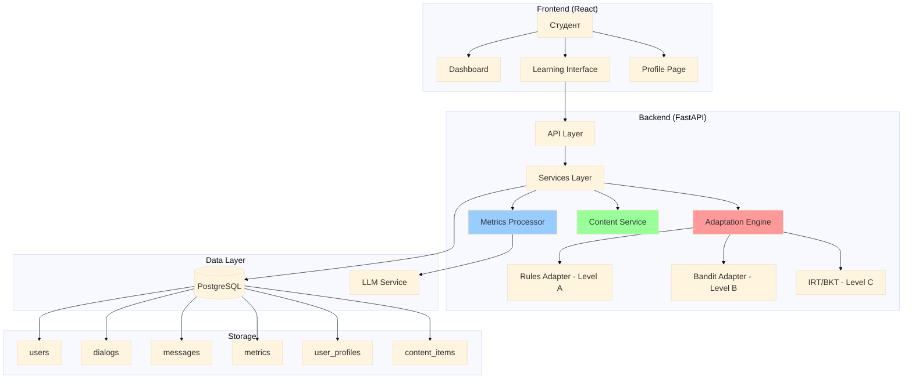

## Повний цикл взаємодії користувача

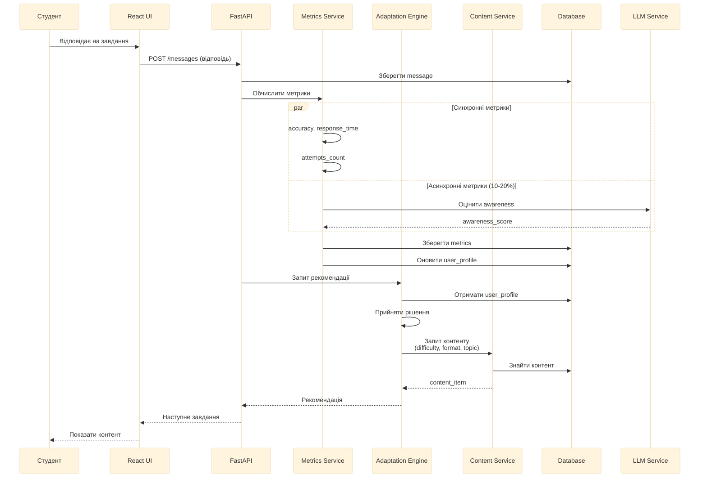

## Процес обчислення метрик

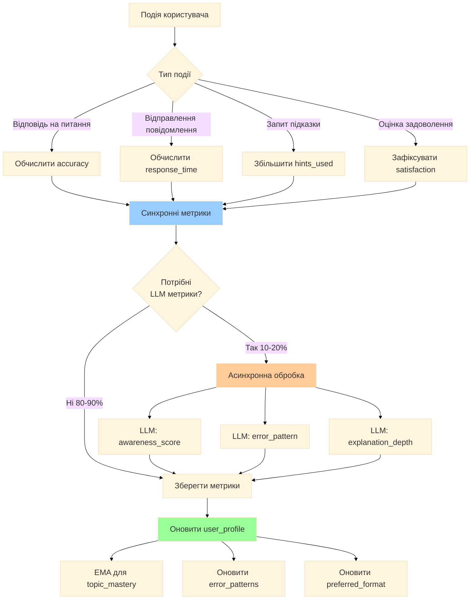

## Адаптаційний механізм: 3 рівні

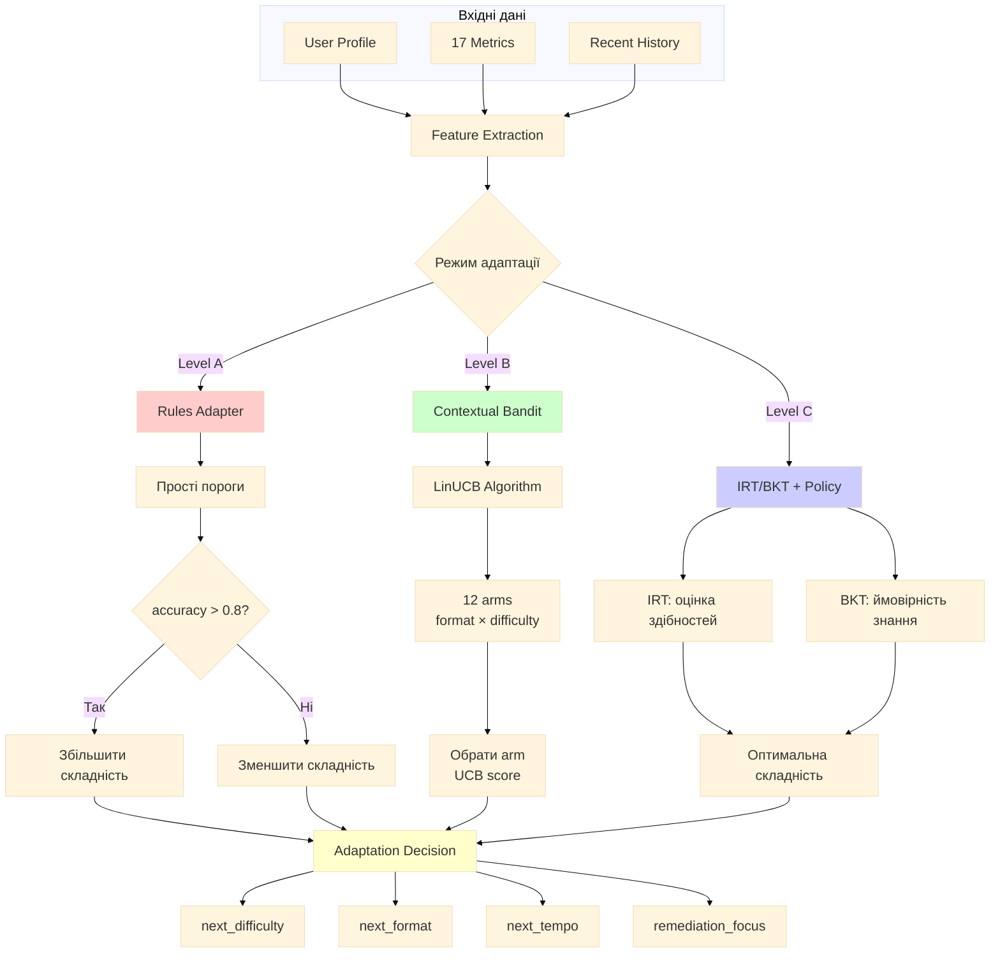

## 17 метрик системи

```mermaid
%%{init: {'theme':'base', 'themeVariables': {'fontSize':'20px'}}}%%
graph TB
    A[17 Метрик] --> B[Educational - 3]
    A --> C[Test - 4]
    A --> D[Assessment - 5]
    A --> E[Reflective - 4]
    A --> F[General - 1]

    B --> B1[interaction_time]
    B --> B2[followups_count]
    B --> B3[satisfaction_score]

    C --> C1[accuracy]
    C --> C2[attempts_count]
    C --> C3[response_time]
    C --> C4[difficulty_result]

    D --> D1[preferred_format]
    D --> D2[error_type]
    D --> D3[satisfaction_score]
    D --> D4[learning_pace]
    D --> D5[difficulty_feedback]

    E --> E1[awareness_score]
    E --> E2[explanation_depth]
    E --> E3[confidence_level]
    E --> E4[error_pattern]

    F --> F1[difficulty_level]

    style A fill:#ffffcc
    style B fill:#ccffcc
    style C fill:#ffcccc
    style D fill:#ccccff
    style E fill:#ffccff
```

## Механізм контекстного бандита (Level B)

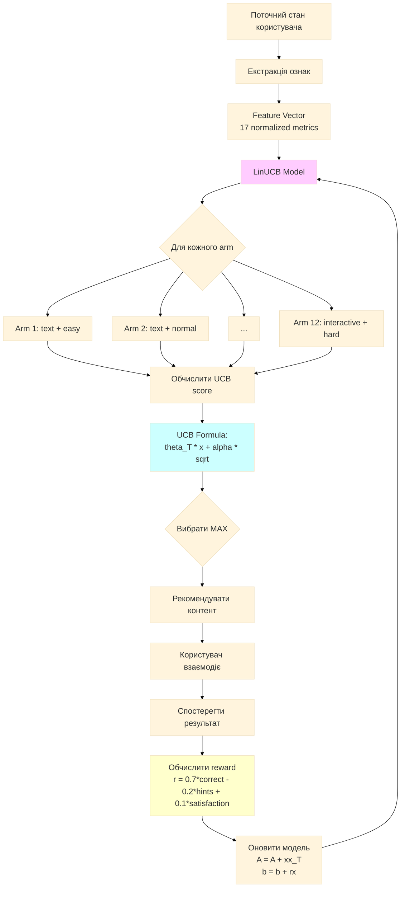

## Типи діалогів та їх цілі

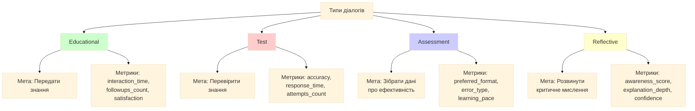

## Оновлення профілю користувача

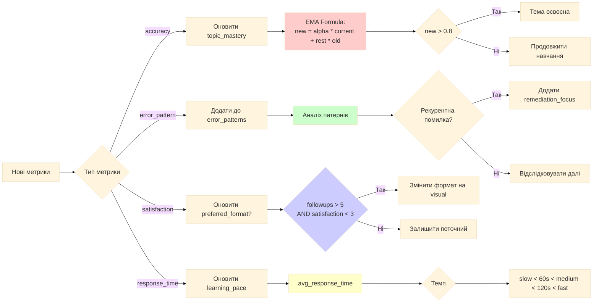

## Вибір контенту на основі адаптації

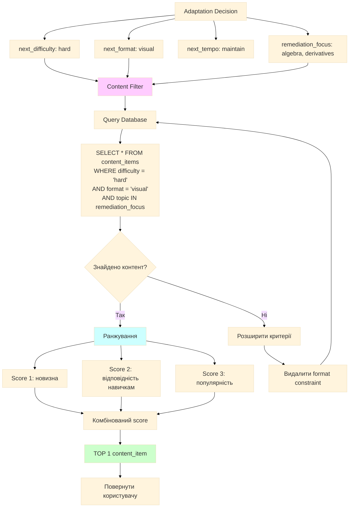

## Зона найближчого розвитку (ZPD)

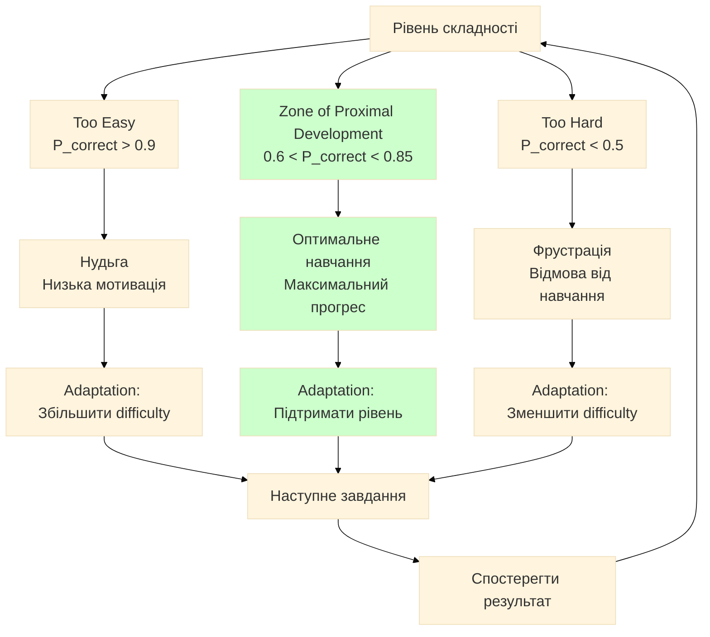

## ML Pipeline: Від даних до рішення

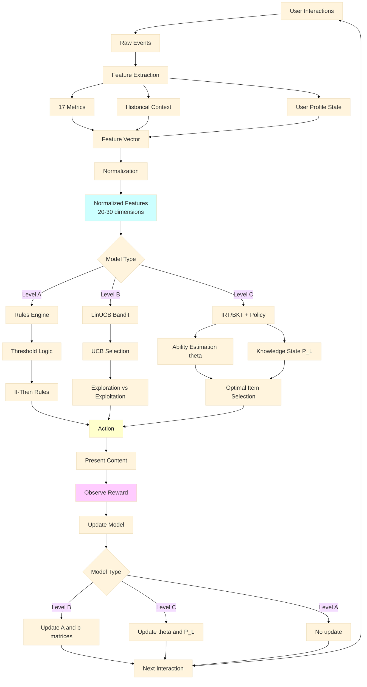

## Архітектура deployment

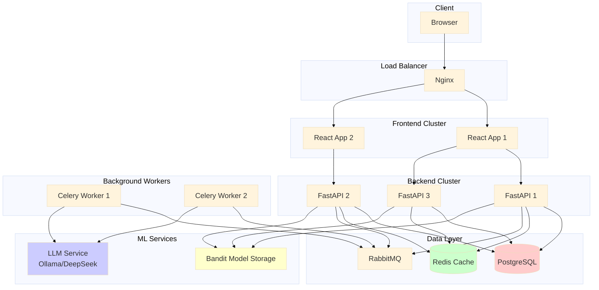

## Інтеграція з LLM

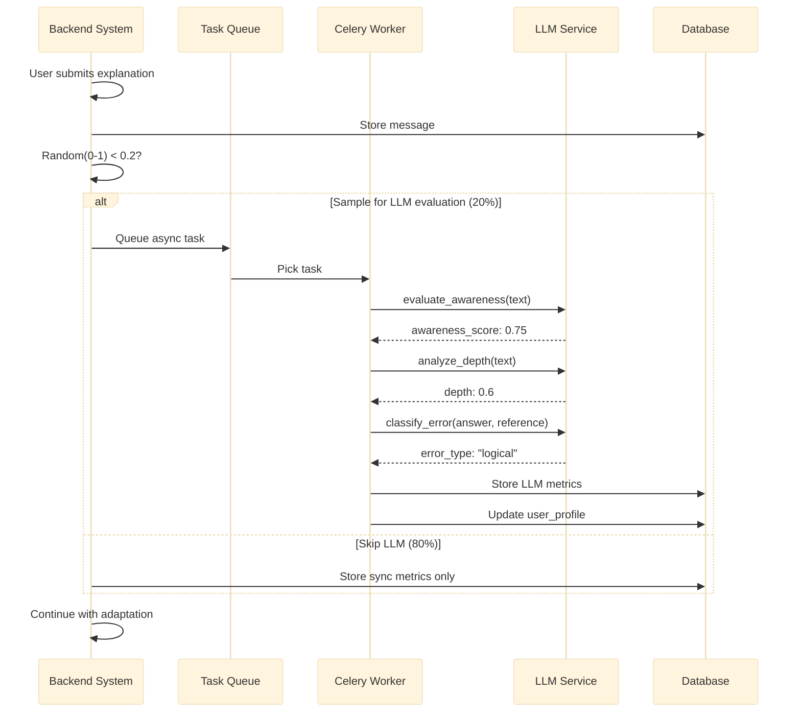

## Експериментальна система (A/B Testing)

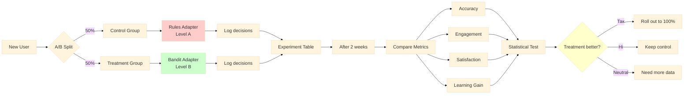

## Ключові метрики успіху

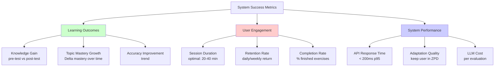

## Резюме: Адаптивний цикл

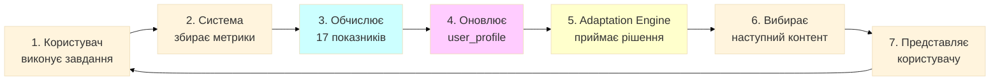

## Bayesian Knowledge Tracing (BKT) - Level C

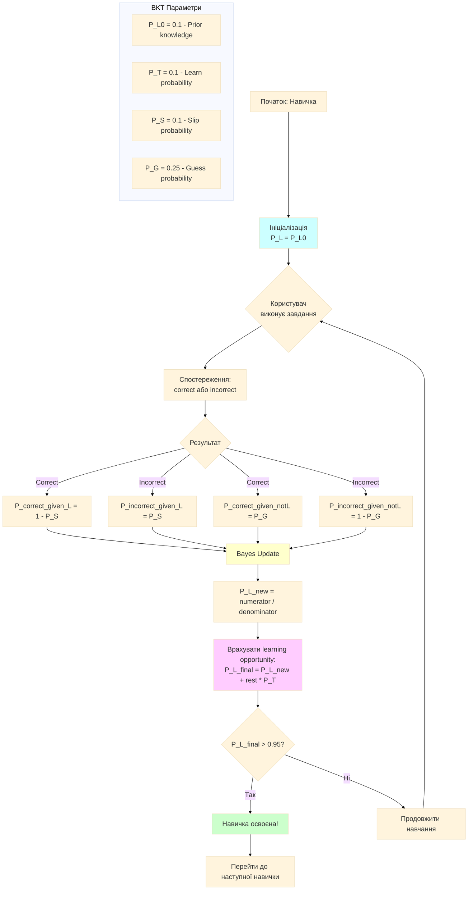

## BKT: Формули та стани

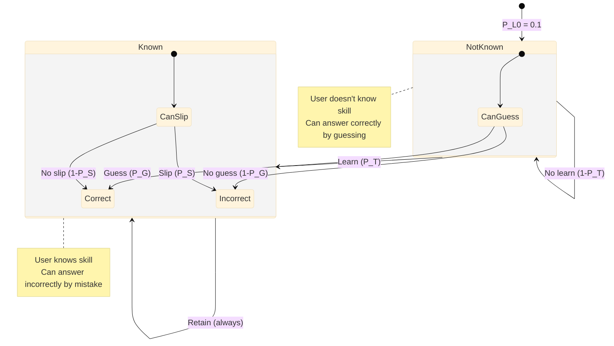

## Rule-Based Adaptation (Level A) - Детальна схема

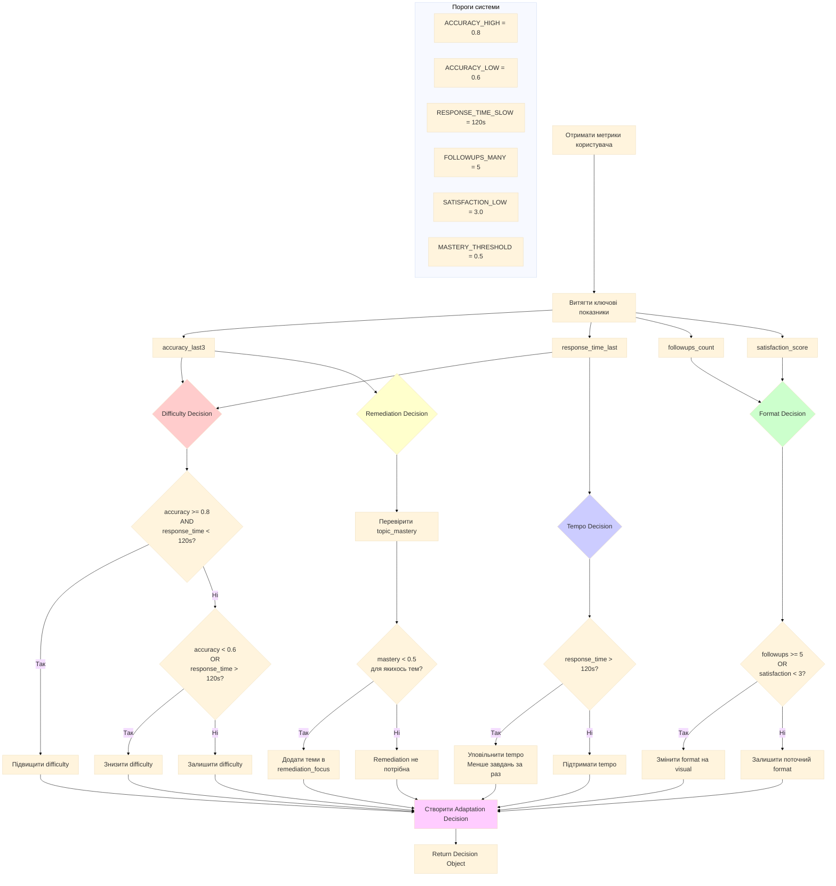

## Rule-Based: Soft Scoring для Gray Zones

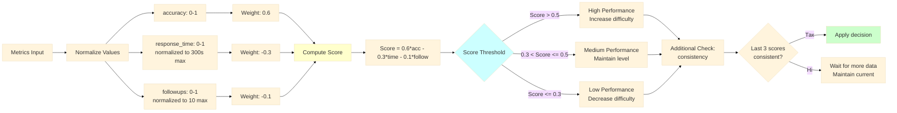

## Rules vs Bandit vs BKT: Порівняння

```mermaid
%%{init: {'theme':'base', 'themeVariables': {'fontSize':'20px'}}}%%
graph TB
    A[Adaptation Approaches] --> B[Level A: Rules]
    A --> C[Level B: Bandit]
    A --> D[Level C: BKT/IRT]

    B --> B1[Pros]
    B1 --> B1a[Швидко - milliseconds]
    B1 --> B1b[Прозоро - легко зрозуміти]
    B1 --> B1c[Не потрібні дані для навчання]
    B1 --> B1d[Легко налаштувати]

    B --> B2[Cons]
    B2 --> B2a[Не адаптується до даних]
    B2 --> B2b[Фіксовані пороги]
    B2 --> B2c[Не враховує індивідуальність]

    C --> C1[Pros]
    C1 --> C1a[Онлайн навчання]
    C1 --> C1b[Баланс exploration/exploitation]
    C1 --> C1c[Адаптується до користувача]
    C1 --> C1d[Швидко збігається]

    C --> C2[Cons]
    C2 --> C2a[Потрібні дані для навчання]
    C2 --> C2b[Складніше налагодити]
    C2 --> C2c[Може застрягти в локальних оптимумах]

    D --> D1[Pros]
    D1 --> D1a[Науково обгрунтовано]
    D1 --> D1b[Психометричні моделі]
    D1 --> D1c[Точна оцінка знань]
    D1 --> D1d[Довгострокове планування]

    D --> D2[Cons]
    D2 --> D2a[Складна імплементація]
    D2 --> D2b[Потрібно багато даних]
    D2 --> D2c[Вища обчислювальна вартість]
    D2 --> D2d[Складна калібрування]

    B --> E1[Use Case:<br/>MVP, прототип]
    C --> E2[Use Case:<br/>Production система]
    D --> E3[Use Case:<br/>Дослідження, академія]

    style B fill:#ffcccc
    style C fill:#ccffcc
    style D fill:#ccccff
```

## Приклад роботи Rule-Based системи

```mermaid
%%{init: {'theme':'base', 'themeVariables': {'fontSize':'20px'}}}%%
sequenceDiagram
    participant U as User
    participant S as System
    participant R as Rules Engine
    participant DB as Database

    U->>S: Відповідає на завдання
    S->>DB: Зберегти відповідь
    S->>S: Обчислити метрики

    Note over S: accuracy = 0.85<br/>response_time = 45s<br/>followups = 2<br/>satisfaction = 4

    S->>R: Запит адаптації

    R->>R: Перевірка accuracy >= 0.8? YES
    R->>R: Перевірка response_time < 120s? YES
    R->>R: Рішення: INCREASE difficulty

    R->>R: Перевірка followups >= 5? NO
    R->>R: Перевірка satisfaction < 3? NO
    R->>R: Рішення: MAINTAIN format

    R->>R: Перевірка response_time > 120s? NO
    R->>R: Рішення: MAINTAIN tempo

    R->>DB: Отримати topic_mastery
    DB-->>R: algebra: 0.45, geometry: 0.75

    R->>R: algebra < 0.5? YES
    R->>R: Рішення: remediation = [algebra]

    R->>S: Decision:<br/>difficulty: hard<br/>format: text<br/>tempo: maintain<br/>remediation: [algebra]

    S->>DB: Знайти контент<br/>WHERE difficulty=hard<br/>AND topic=algebra

    DB-->>S: content_item

    S->>U: Представити складніше завдання з алгебри

    Note over U,S: Користувач добре справився,<br/>тому система підвищила складність<br/>і фокусується на слабкій темі
```

---

## Пояснення компонентів

### Frontend (React)
- **Dashboard**: Огляд прогресу, рекомендації
- **Learning Interface**: Основний екран навчання з чатом і контентом
- **Profile**: Налаштування та статистика користувача

### Backend (FastAPI)
- **API Layer**: REST endpoints для CRUD операцій
- **Services Layer**: Бізнес-логіка (UserService, DialogService, MetricsService)
- **Adaptation Engine**: Мозок системи - приймає рішення про адаптацію
- **Metrics Processor**: Обчислює 17 метрик і оновлює профілі

### Database (PostgreSQL)
- **users**: Облікові записи
- **dialogs**: Сесії навчання
- **messages**: Повідомлення в діалогах
- **content_items**: Навчальні матеріали з метаданими
- **metrics**: Часові ряди метрик
- **user_profiles**: Агреговані дані про користувачів

### Adaptation Levels
- **Level A (Rules)**: Прості пороги - швидко, прозоро, MVP
- **Level B (Bandit)**: Контекстний бандит - баланс простоти та продуктивності
- **Level C (IRT/BKT)**: Психометричні моделі - науково обґрунтовано

### LLM Integration
- **Асинхронне обчислення** складних метрик (awareness, depth, error patterns)
- **Вибіркова обробка**: 10-20% взаємодій для оптимізації вартості
- **Генерація контенту**: Підказки, перефразування

### Ключові принципи
1. **Зона найближчого розвитку**: Утримання P(correct) ≈ 0.65-0.75
2. **Персоналізація**: Адаптація складності, формату, темпу
3. **Онлайн навчання**: Модель покращується з кожною взаємодією
4. **Метрики**: 17 різних вимірів для повної картини
5. **Модульність**: Легко замінювати компоненти

---

Ця схема демонструє повний цикл роботи адаптивної системи навчання від взаємодії користувача до прийняття рішень про наступний контент.
