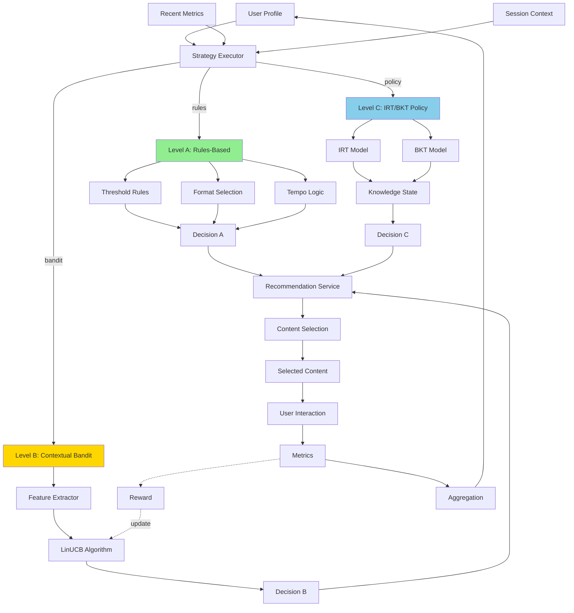

# Три Рівні Механізму Адаптації

## Архітектура Багаторівневої Адаптації



## Порівняльна Таблиця Рівнів

| Характеристика | Level A: Rules | Level B: Bandit | Level C: IRT/BKT |
|----------------|----------------|-----------------|------------------|
| **Статус** | ✅ Реалізовано | 🔄 Планується Week 7 | 🔮 Майбутнє |
| **Складність** | Проста | Середня | Висока |
| **Навчання** | Немає | Online learning | Probabilistic + RL |
| **Швидкість** | < 10ms | < 50ms | < 200ms |
| **Передбачуваність** | ✅ Повна | ⚠️ Частково | ❌ Складна |
| **Потреба в даних** | Мінімальна | Середня (100+ interactions) | Висока (1000+ interactions) |
| **Персоналізація** | Базова | Добра | Відмінна |
| **Пояснюваність** | ✅ Повна | ⚠️ UCB scores | ❌ Black box |
| **Production ready** | ✅ Так | 🔄 Тестування | ❌ Research only |

## Детальний Опис Рівнів

### Level A: Rules-Based Adapter ⚡

**Принцип роботи:**
- Threshold-based rules для difficulty adjustment
- User preferences для format selection
- Response time для tempo recommendations
- Topic mastery для remediation

**Алгоритм:**
```
IF avg_accuracy > 0.8 AND recent_accuracy > 0.85:
    difficulty ↑ (hard → challenge)
ELIF avg_accuracy < 0.5 OR recent_accuracy < 0.4:
    difficulty ↓ (normal → easy)
ELSE:
    maintain current difficulty

IF topic_mastery[topic] < 0.5:
    add to remediation_topics

format = user.preferred_format OR most_successful_format
```

**Переваги:**
- ✅ Швидка розробка та deployment
- ✅ Повна контрольованість та передбачуваність
- ✅ Легке debugging та пояснення рішень
- ✅ Не потребує historical data

**Недоліки:**
- ❌ Фіксовані thresholds (не адаптуються)
- ❌ Не враховує складні взаємозв'язки features
- ❌ Обмежена персоналізація

---

### Level B: Contextual Bandit 🤖

**Принцип роботи:**
- LinUCB algorithm: Upper Confidence Bound
- 16 arms: 4 difficulty levels × 4 formats
- 17 context features з user profile
- Online learning після кожної interaction

**Алгоритм:**
```
context = extract_features(user_profile, recent_metrics)
  → [avg_accuracy, topic_mastery_mean, response_time, ...]

For each arm a:
    θ_a = A_a^(-1) * b_a
    UCB(a) = θ_a^T * context + α * sqrt(context^T * A_a^(-1) * context)

selected_arm = argmax(UCB)
  → decode to (difficulty, format)

After user interaction:
    reward = 0.5*accuracy + 0.2*(1-normalized_time) + 0.15*(1-hints) + 0.15*engagement
    A_a ← A_a + context * context^T
    b_a ← b_a + reward * context
```

**Переваги:**
- ✅ Автоматичне навчання з досвіду
- ✅ Balance exploration/exploitation
- ✅ Персоналізація для кожного user
- ✅ Не потребує pre-training (cold start OK)

**Недоліки:**
- ⚠️ Потребує 100-200 interactions для convergence
- ⚠️ Alpha tuning необхідний
- ⚠️ Менша передбачуваність ніж rules

---

### Level C: IRT/BKT + Policy Learning 🔬

**Принцип роботи:**
- IRT (Item Response Theory): моделювання difficulty vs ability
- BKT (Bayesian Knowledge Tracing): tracking P(knowledge|evidence)
- Policy Network (RL): оптимізація довготривалого learning gain

**Алгоритм:**
```
# IRT: Estimate user ability θ
P(correct|θ, difficulty_i) = 1 / (1 + exp(-(θ - difficulty_i)))
θ_user = estimate_ability(responses)

# BKT: Track knowledge state
P(L_t|evidence) = update_bayes(P(L_t-1), correctness, slip, guess)

# Policy: Select optimal action
state = [θ_user, P(L), topic_mastery, ...]
action = policy_network(state)  # trained via PPO/A3C
  → (next_difficulty, next_topic, next_format)

# Maximize long-term reward
reward = immediate_learning_gain + γ * future_mastery
```

**Переваги:**
- ✅ Теоретично обґрунтовані моделі (IRT/BKT)
- ✅ Probabilistic knowledge tracking
- ✅ Оптимізація довготривалого прогресу
- ✅ Підходить для academic research

**Недоліки:**
- ❌ Складна реалізація та налаштування
- ❌ Потребує великі datasets (1000+ interactions)
- ❌ Computational overhead (RL training)
- ❌ Black box (важко пояснити рішення)

---

## Поетапний Roadmap

### ✅ Phase 1: MVP (Completed)
- Rules-based adapter реалізовано
- Metrics collection working
- Profile aggregation functioning
- Production deployment ready

### 🔄 Phase 2: ML Enhancement (Week 7)
- LinUCB implementation
- Feature extraction (17 features)
- Reward computation
- A/B testing vs rules

### 🔮 Phase 3: Advanced Research (Future)
- IRT calibration
- BKT knowledge tracking
- Policy network training
- Academic evaluation

---

## Використання в Проекті

**Поточний стан:**
```python
# backend/app/core/adaptation/engine.py
class AdaptationEngine:
    def __init__(self, strategy: AdaptationStrategy = RULES):
        if strategy == AdaptationStrategy.RULES:
            self.adapter = RulesAdapter()      # ✅ Level A
        elif strategy == AdaptationStrategy.BANDIT:
            self.adapter = BanditAdapter()     # 🔄 Level B (Week 7)
        elif strategy == AdaptationStrategy.POLICY:
            self.adapter = PolicyAdapter()     # 🔮 Level C (Future)
```

**Config:**
```python
# backend/app/config.py
ADAPTATION_MODE = "rules"  # "rules" | "bandit" | "policy"
BANDIT_ALPHA = 1.5
BANDIT_MODEL_PATH = "models/linucb_bandit.npz"
```

---

## Джерела

- **Level A**: `backend/app/core/adaptation/rules.py`
- **Level B**: `docs/weeks/week_7.md`, `docs/claude/ml_pipeline.md` (lines 235-417)
- **Level C**: `docs/claude/ml_pipeline.md` (lines 433-646)
- **Architecture**: `backend/app/core/adaptation/engine.py`
