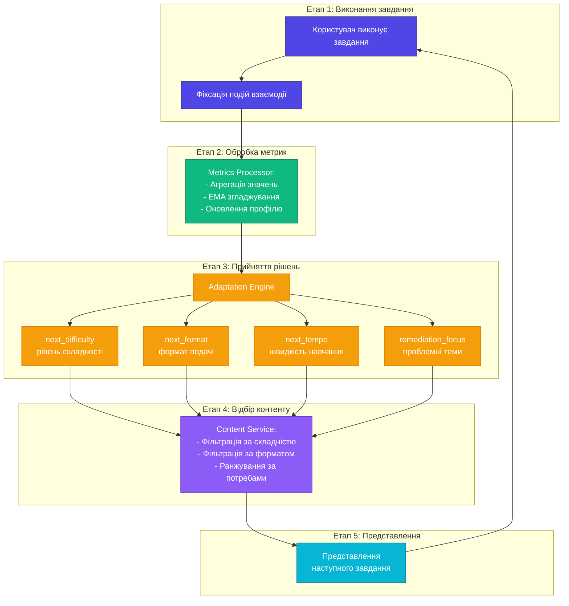

# Цикл адаптації навчального процесу

## Рис. 3.4 – Adaptation Loop (5 етапів)

## П'ять етапів циклу адаптації

### Етап 1: Виконання завдання
- Користувач виконує навчальне завдання
- Фіксація подій взаємодії
- Обчислення первинних метрик

### Етап 2: Обробка метрик (Metrics Processor)
- Агрегація отриманих значень
- Застосування експоненційних середніх (EMA)
- Інтерпретація поведінкових патернів
- Оновлення профілю користувача

### Етап 3: Прийняття рішень (Adaptation Engine)
Чотири ключові педагогічні рішення:
- **next_difficulty**: рівень складності наступного завдання
- **next_format**: формат подачі (текст/візуал/відео/інтерактив)
- **next_tempo**: швидкість та обсяг матеріалу
- **remediation_focus**: теми для додаткового опрацювання

### Етап 4: Відбір контенту (Content Service)
- Фільтрація за рівнем складності
- Фільтрація за форматом подачі
- Фільтрація за темою та вимогами
- Ранжування за специфічними потребами користувача

### Етап 5: Представлення
- Представлення рекомендованого завдання користувачу
- Запуск нового циклу взаємодії

## Педагогічний фундамент

**Принцип Зони Найближчого Розвитку (ЗНР):**
- Завдання є посильними, але потребують зусиль
- Уникнення надто легкого або складного матеріалу
- Оптимальне навантаження для стійкого засвоєння знань
