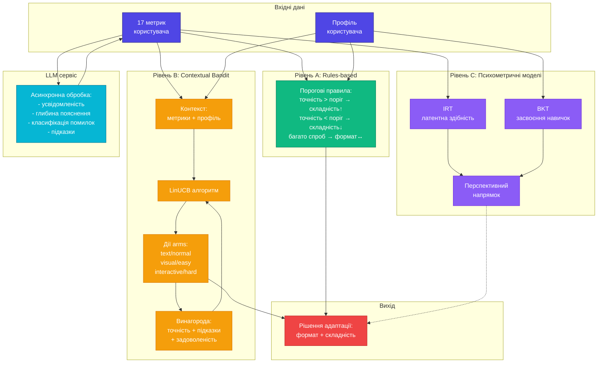

# Алгоритмічна структура адаптаційного модуля

## Рис. 3.3 – Багаторівнева адаптація

## Опис рівнів адаптації

### Рівень A: Rules-based адаптація
- Порогові значення ключових метрик
- Прозорі правила зміни складності
- Працює без попереднього навчання
- Базовий механізм адаптації

### Рівень B: Contextual Bandit (LinUCB)
- Контекст: 17 метрик + профіль користувача
- Дії (arms): комбінації формату та складності
- Винагорода: точність + підказки + задоволеність
- Балансує exploration vs exploitation

### Рівень C: Психометричні моделі (перспектива)
- **IRT**: оцінка латентної здібності
- **BKT**: відстеження засвоєння навичок
- Закладено в архітектурі
- Не реалізовано в поточному прототипі

### LLM сервіс
- Асинхронна обробка складних метрик
- Оцінка усвідомленості та глибини пояснень
- Класифікація типів помилок
- Генерація контекстних підказок
