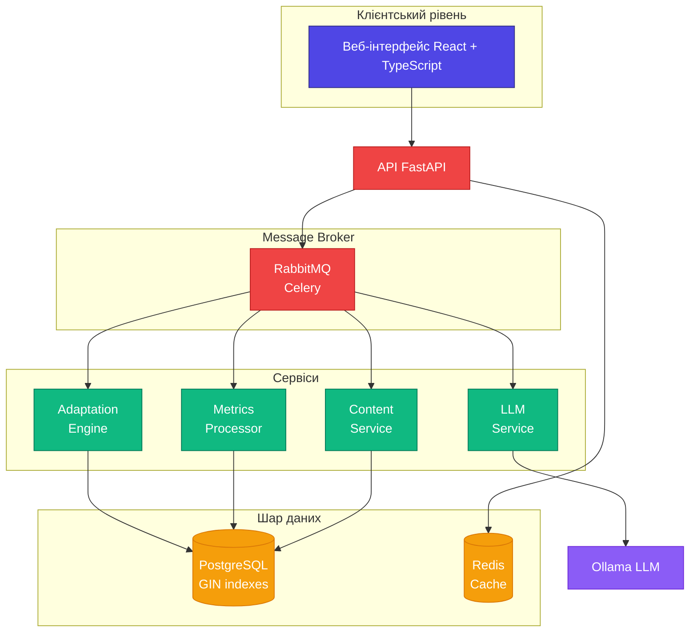

# Діаграма архітектури

## Архітектура системи адаптивного навчання

```mermaid
graph TB
    subgraph "Клієнтський рівень"
        WebUI[Веб-інтерфейс React + TypeScript]
    end

    WebUI --> API[API FastAPI]

    subgraph "Message Broker"
        direction LR
        RabbitMQ[RabbitMQ<br/>Celery]
    end

    API --> RabbitMQ

    subgraph "Сервіси"
        direction LR
        AdaptEngine[Adaptation<br/>Engine]
        MetricsProc[Metrics<br/>Processor]
        ContentService[Content<br/>Service]
        LLMService[LLM<br/>Service]
    end

    RabbitMQ --> AdaptEngine
    RabbitMQ --> MetricsProc
    RabbitMQ --> ContentService
    RabbitMQ --> LLMService

    subgraph "Шар даних"
        direction LR
        PostgreSQL[(PostgreSQL<br/>GIN indexes)]
        RedisCache[(Redis<br/>Cache)]
    end

    AdaptEngine --> PostgreSQL
    MetricsProc --> PostgreSQL
    ContentService --> PostgreSQL
    API --> RedisCache

    LLMService --> Ollama[Ollama LLM]

    classDef client fill:#4f46e5,stroke:#312e81,color:#fff
    classDef broker fill:#ef4444,stroke:#b91c1c,color:#fff
    classDef service fill:#10b981,stroke:#047857,color:#fff
    classDef data fill:#f59e0b,stroke:#d97706,color:#fff
    classDef ml fill:#8b5cf6,stroke:#6d28d9,color:#fff

    class WebUI client
    class API,RabbitMQ broker
    class AdaptEngine,MetricsProc,ContentService,LLMService service
    class PostgreSQL,RedisCache data
    class Ollama ml
```
