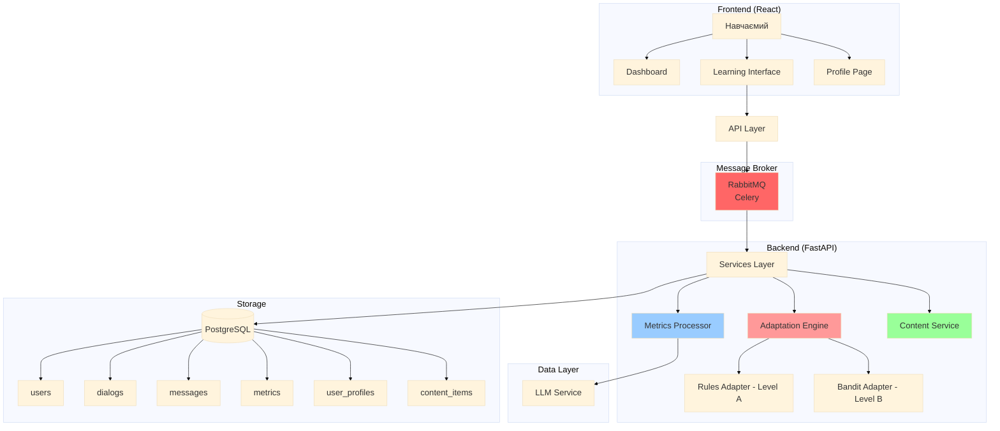

# Діаграма архітектури (детальна)

## Архітектура системи адаптивного навчання з компонентами

```mermaid
%%{init: {'theme':'base', 'themeVariables': {'fontSize':'20px'}}}%%
graph TB
    subgraph "Frontend (React)"
        A[Навчаємий] --> B[Dashboard]
        A --> C[Learning Interface]
        A --> D[Profile Page]
    end

    C --> E[API Layer]

    subgraph "Message Broker"
        direction LR
        Broker[RabbitMQ<br/>Celery]
    end

    E --> Broker

    subgraph "Backend (FastAPI)"
        F[Services Layer]
        G[Adaptation Engine]
        H[Metrics Processor]
        I[Content Service]

        G --> J[Rules Adapter - Level A]
        G --> K[Bandit Adapter - Level B]
    end

    Broker --> F
    F --> G
    F --> H
    F --> I

    subgraph "Data Layer"
        N[LLM Service]
    end

    subgraph "Storage"
        M[(PostgreSQL)]
        M --> O[users]
        M --> P[dialogs]
        M --> Q[messages]
        M --> R[metrics]
        M --> S[user_profiles]
        M --> T[content_items]
    end

    H --> N
    F --> M

    style G fill:#ff9999
    style H fill:#99ccff
    style I fill:#99ff99
    style Broker fill:#ff6666
```
