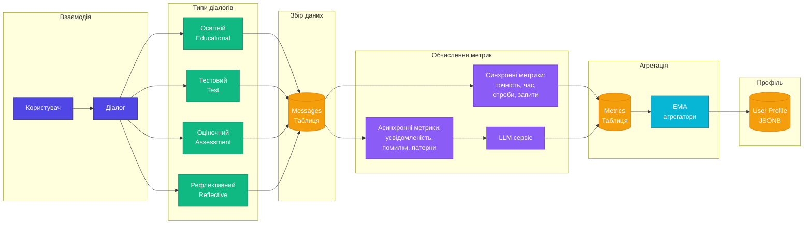

# Схема збору та агрегування метрик користувача

## Рис. 3.2 – Конвеєр обробки метрик

## 17 навчальних метрик (4 категорії)

**Освітні (Educational):**
- Тривалість взаємодії
- Кількість уточнювальних запитів
- Суб'єктивна зрозумілість

**Тестові (Test):**
- Точність відповідей
- Час реагування
- Кількість спроб
- Рівень складності завдання

**Оціночні (Assessment):**
- Переваги формату подачі
- Типові помилки
- Задоволеність процесом
- Темп навчання

**Рефлективні (Reflective):**
- Рівень усвідомленості
- Глибина пояснень
- Впевненість у відповідях
